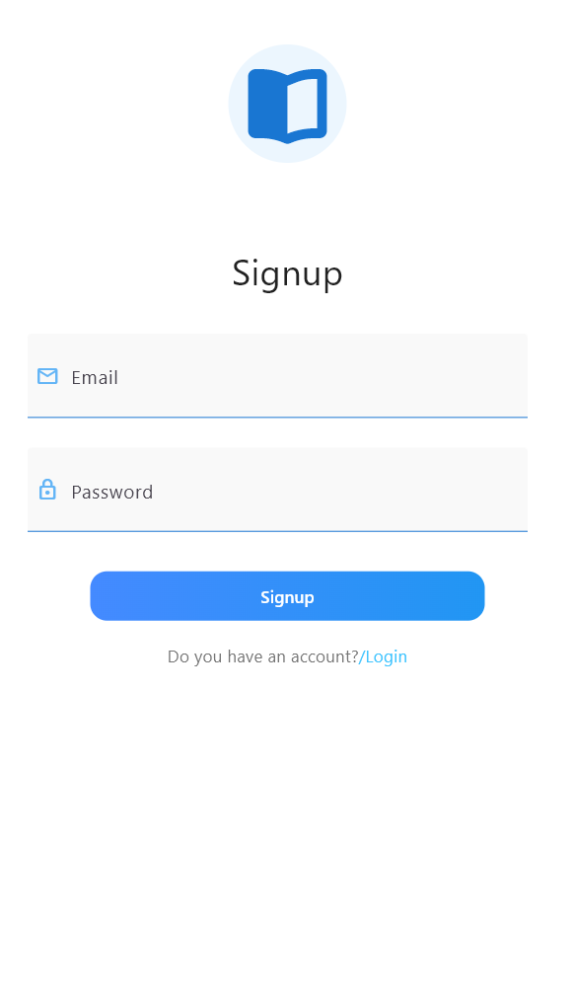
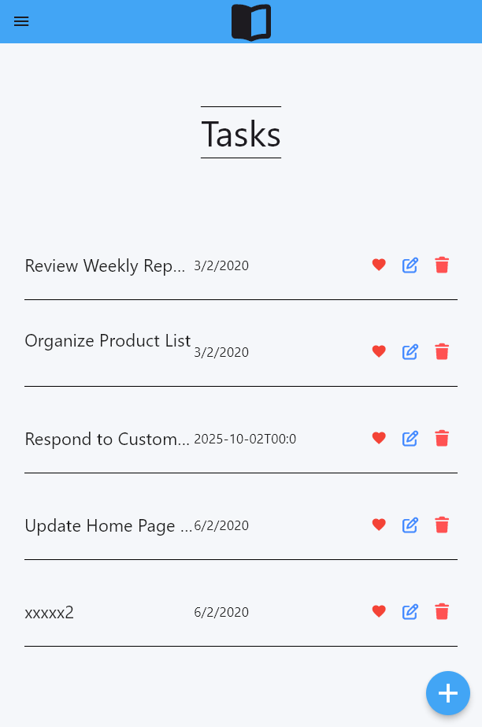
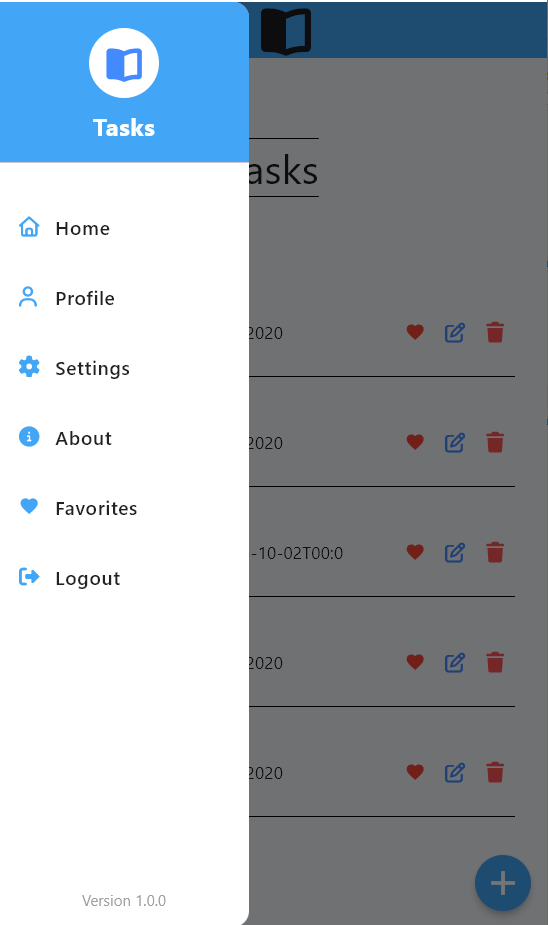
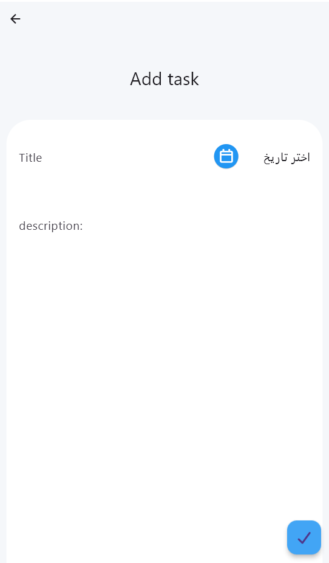
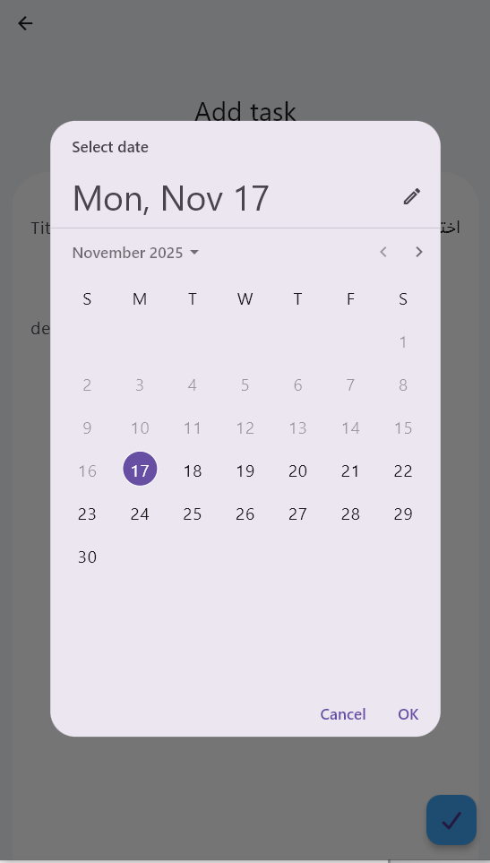
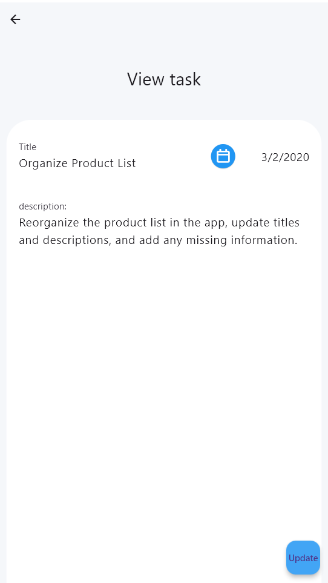
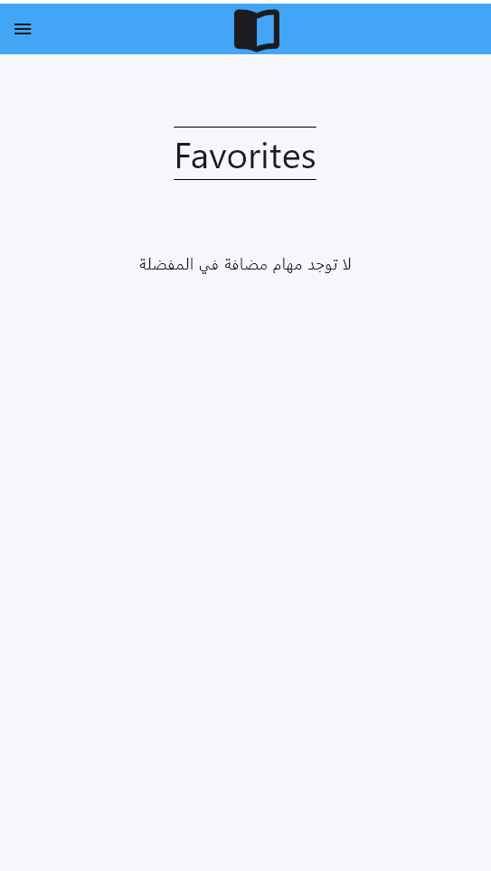

# Task Management App
- A comprehensive Flutter task management application with REST API integration. 
Features state management using GetX and full CRUD operations through API.
----
##  Features

- User login and registration
- Task list display
- Add new tasks
- Edit existing tasks
- Delete tasks
- Add tasks to favorites
- Navigation AppBar
- Side drawer
- Full REST API integration

---
## 📸 Screenshots
<div align="center">
  
  
  
  
  
  
  
  
</div>

----
## 🛠 Tech Stack

- **Flutter** - Main framework
- **Dart** - Programming language
- **GetX** - State management and navigation
- **REST API** - Server communication
- **HTTP** - Networking package


---
##  Dependencies
```yaml
dependencies:
  flutter:
    sdk: flutter
  cupertino_icons: ^1.0.8
  http: ^1.5.0
  shared_preferences: ^2.5.3
  get_storage: ^2.1.1
  image_picker: ^1.2.0
  get: ^4.7.2
  intl: ^0.20.2
  google_fonts: ^6.3.1
  font_awesome_flutter: ^10.7.0

  ```
----
##  API Configuration

- Ensure local server is running or use live API
- Modify API base URL in configuration file


-----

##  Installation & Run

### Prerequisites
- Flutter SDK 3.35.2 or higher
- Dart SDK 3.9.0 or higher
- Android emulator or physical device

### Run Steps
1. Clone the repository
2. Navigate to project directory
3. Install dependencies
4. Run the application

---
##  Usage

1. Create new account or login
2. View current tasks list
3. Add new task
4. Edit or delete tasks
5. Manage favorite tasks


---
## Project Structuretr

│lib
│   main.dart
│
├───Binding
│       Binding.dart
│
├───Controllers
│       add_Controller.dart
│       Delet_Controller.dart
│       Favorites_Controller.dart
│       Home_controller.dart
│       login_Controller.dart
│       Signup_Controller.dart
│       Update_controller.dart
│
├───meddlewares
│       Login_meddleware.dart
│
├───models
│       app_styles.dart
│       FavoriteModel.dart
│       homemodel.dart
│       usermodel.dart
│
├───Srevices
│       Curd.dart
│       Links.dart
│
├───views
│       add_page.dart
│       Favorires_page.dart
│       homepages.dart
│       Login_page.dart
│       Signup_page.dart
│       Update_page.dart
│
└───Widgets
AddtoFavorire_Widget.dart
Card.dart
Crad_widget.dart
CustomDrawer.dart
DrawerItems_widget.dart
Remove_widget.dart
terst.dart
TextFormfield.dart

``
----
## ⚙️Configuration

- Ensure all packages mentioned in dependencies are installed
- No additional configuration required

----

## 💭 Notes

- This project aims to implement REST API concepts and GetX in a practical application

----
## Developer
- App developed by [Amjad alshehabi]
- Email:[ aslhehabiamjad28@gmail.com]

---
- If you like this project, give it a star  ⭐ 


